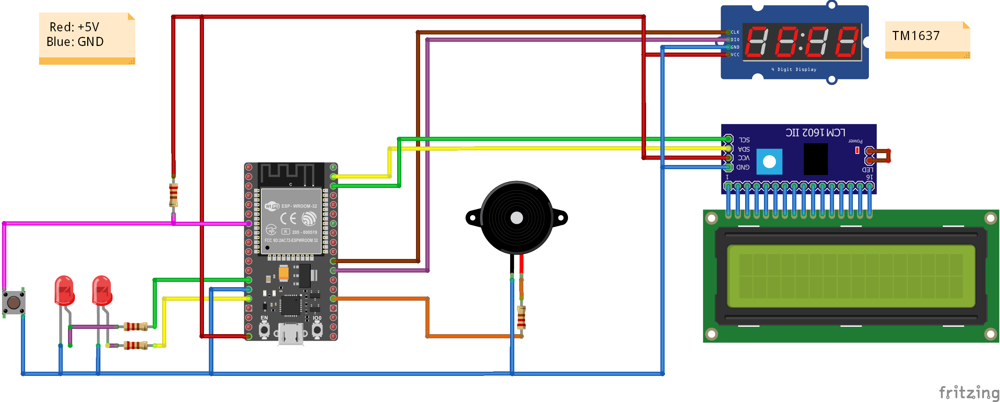

# Miner Utility ESP32

## Dependencies

- **Config Setup for esp32**: <https://learn.adafruit.com/adafruit-esp32-feather-v2/arduino-ide-setup?gclid=Cj0KCQjwspKUBhCvARIsAB2IYuusW4fzIOAJFdCHOSUDSvPui8_epteo6yo4G-yMXP0KPlNABeTn2GUaAsT3EALw_wcB>

- Install esp32 dependencies:
  - HTTPClient.h
  - Preferences.h
  - Wire.h
  - LiquidCrystal_I2C.h
  - TM1637Display.h
  - NTPClient.h
  - WiFiUdp.h
  - WebServer.h
  - TM1637Display.h
  - ArduinoJson.h
  - pitches.h
  - TM1637Display.h
  - TM1637Display.h

- To run the project you need move the **CoinSound, CustomerServer, Json, Tone32 and Wifi** folders to ```Arduino/libraries```

## Utility Configuration

1. Connect a device to the access point ```minerUtilityConfig```.
2. Send the ETH wallet address to 192.168.4.1/ethwallet using the next body:

``` json
{
  "wallet": "xxx"
}
```

3. Send the wifi ssid and password to 192.168.4.1/wifiConfig using the next body:

``` json
{
  "ssid": "xxx",
  "password": "xxx"
}
```

## Utility features

- Show hashrate.
- Show unpaid balance on ETH, USD and ARS.
- Show monthly profit on ETH, USD and ARS.

### HW connections

#### LEDS

- Green &rarr; GPIO 12 - 220 OHM - GND
- RED &rarr; GPIO 13 - 220 OHM - GND

#### Button

- Pull Up 220 OHM &rarr; GPIO 32 - GND 5V

#### LCD I2C

- SDA &rarr; GPIO 23
- SCL &rarr; GPIO 22
- 5V - GND

#### Numeric Display

- DIO &rarr; GPIO 16
- CLK &rarr; GPIO 17
- 5V - GND

#### Buzzer

- GPIO 2 - 220 OHM - GND


